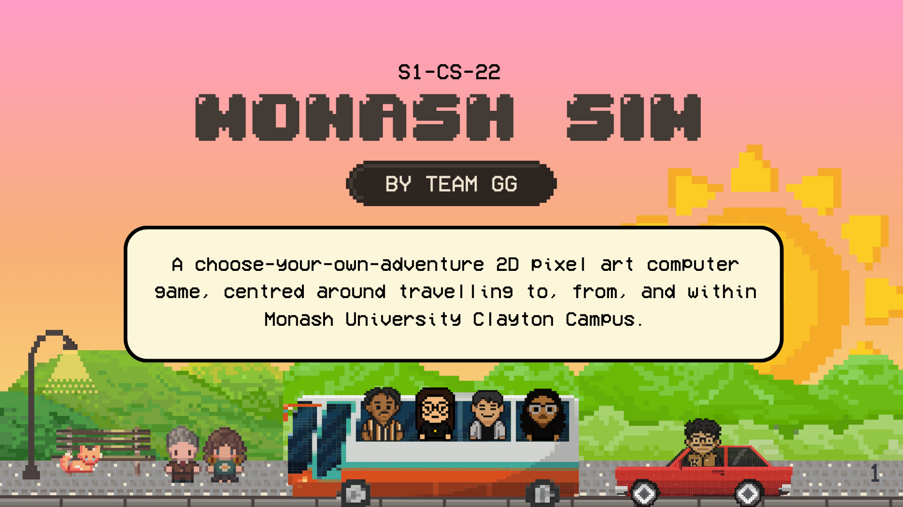

<div align="center">




**Built by Team GG (S1-CS-22)**

[Bonsen Wakjira](https://www.linkedin.com/in/bonsen-wakjira/) • [Zahir Hassan](https://www.linkedin.com/in/zahirhassan-cs/) • [Jia Wen Ooi](https://www.linkedin.com/in/jiawenooi22/) • [Anika Ojha](https://www.linkedin.com/in/anikaojha/) • [Jiun How](https://www.linkedin.com/in/jiuneehow/)

</div>

---

## 🎮 Features

### Core Gameplay Systems
- **MONASH Stats System**: Manage five key attributes (Mobility, Organisation, Networking, Aura, Skills)
- **Resource Management**: Track hunger, time, and money throughout each day
- **Dynamic Storytelling**: Experience a branching narrative with meaningful choices
- **Character Relationships**: Build rapport with five unique NPCs, each with distinct personalities and majors

### Interactive Elements
- **Mini-games**: Engage in commute challenges (walking, bus, driving)
- **Campus Exploration**: Navigate a tile-based campus map with multiple hotspots
- **Phone System**: Interact through texts, check your map, manage notes, and browse social feeds
- **Save System**: Auto-save feature with manual save/load functionality
- **Audio System**: Immersive background music and sound effects

### Technical Highlights
- **State Management**: Robust game state system with validation and persistence
- **Scene Management**: Modular scene architecture for easy extensibility
- **Sprite System**: Custom sprite loading and rendering with animation support
- **Tileset Engine**: Dynamic tileset loading with collision detection
- **PWA Support**: Progressive Web App capabilities for offline play

## 🛠️ Tech Stack

- **Framework**: Vanilla TypeScript with Vite build tool
- **Rendering**: HTML5 Canvas API for 2D graphics
- **State Management**: Custom Zustand-inspired store with Zod schema validation
- **Audio**: Web Audio API wrapper for music and sound effects
- **Persistence**: LocalStorage-based save system
- **Type Safety**: Full TypeScript with strict mode enabled

## 📁 Project Structure

```
monashsimv2/
├── src/
│   ├── core/          # Core game systems (state, actions, store)
│   ├── scenes/        # Game scenes (menu, bedroom, campus, etc.)
│   ├── minigames/     # Interactive mini-games
│   ├── data/          # Game data (NPCs, majors, maps)
│   ├── sprites/       # Sprite rendering and animation
│   ├── ui/            # UI components (phone, stats bar, cutscenes)
│   └── utils/         # Utilities (audio, save system, loaders)
├── public/
│   ├── audio/         # Sound effects and music
│   └── sprites/       # Character and environment sprites
└── docs/              # Documentation and guides
```

## 🚀 Getting Started

### Prerequisites
- Node.js 18.0.0 or higher
- npm or yarn package manager

### Installation

1. **Clone the repository**
   ```bash
   git clone https://github.com/your-username/monash-sim.git
   cd monash-sim
   ```

2. **Install dependencies**
   ```bash
   npm install
   ```

3. **Run development server**
   ```bash
   npm run dev
   ```

4. **Open your browser**
   Navigate to `http://localhost:5173`

### Build for Production

```bash
npm run build
```

The built files will be in the `dist/` directory.

### Preview Production Build

```bash
npm run preview
```

## 🎯 Game Overview

### Day 1 Gameplay Loop
1. **Character Creation**: Choose your major and receive starting stats
2. **Morning Commute**: Select your transportation method (walk, bus, or drive)
3. **Campus Exploration**: Visit the cafeteria, library, and lecture theatre
4. **Group Meeting**: Meet your five teammates and build initial rapport
5. **Assignment Introduction**: Receive your group project topic
6. **Phone Tutorial**: Learn to use the in-game phone interface
7. **Evening Activities**: Choose how to spend your evening
8. **Day Recap**: Review your stats, relationships, and decisions

### Available Majors
- **Engineering**: High Skills and Mobility
- **Medicine**: Balanced with strong Organisation
- **Law**: Strong Organisation and Aura
- **IT**: Balanced stats with moderate Skills
- **Science**: High Skills and scientific aptitude
- **Arts**: High Aura and creative thinking

### NPC Characters
- **Bonsen (IT)**: Tech-savvy problem solver
- **Zahir (Medicine)**: Diligent and empathetic
- **Jiun (Science)**: Analytical and data-driven
- **Anika (Law)**: Direct and organized
- **Jia Wen (Arts)**: Creative and collaborative

## 📚 Documentation

- [Deployment Guide](docs/guides/deployment.md) - Deploy to Vercel
- [Development Design](docs/development/day1-design.md) - Day 1 design specifications
- [Tileset Guide](docs/TILESET_GUIDE.md) - Working with tilesets
- [Audio System](docs/AUDIO_SYSTEM_GUIDE.md) - Audio implementation guide
- [Sprite System](docs/SPRITE_MIGRATION_GUIDE.md) - Sprite rendering documentation

## 🎨 Customization

### Adding Your Own Soundtrack
1. Place your MP3 file in `public/audio/music/`
2. Update the path in `src/main.ts`:
   ```typescript
   await playBackgroundMusic('/audio/music/your-track.mp3', {
     loop: true,
     volume: 0.6
   });
   ```

### Creating Custom Tilesets
See [Using Tilesets Guide](docs/guides/using-tilesets.md) for detailed instructions.

## 🤝 Contributing

This is currently a personal project, but suggestions and feedback are welcome! Feel free to:
- Report bugs by opening an issue
- Suggest features or improvements
- Submit pull requests for bug fixes

## 📄 License

This project is available for educational and portfolio purposes.

## 🙏 Acknowledgments

- Inspired by university life simulation games
- Built as a full-stack game development project
- Special thanks to Monash University for the inspiration

## 📧 Contact

For questions or feedback, please open an issue on GitHub.

---

**Note**: This is a portfolio project demonstrating game development skills with TypeScript, Canvas API, and modern web technologies.
